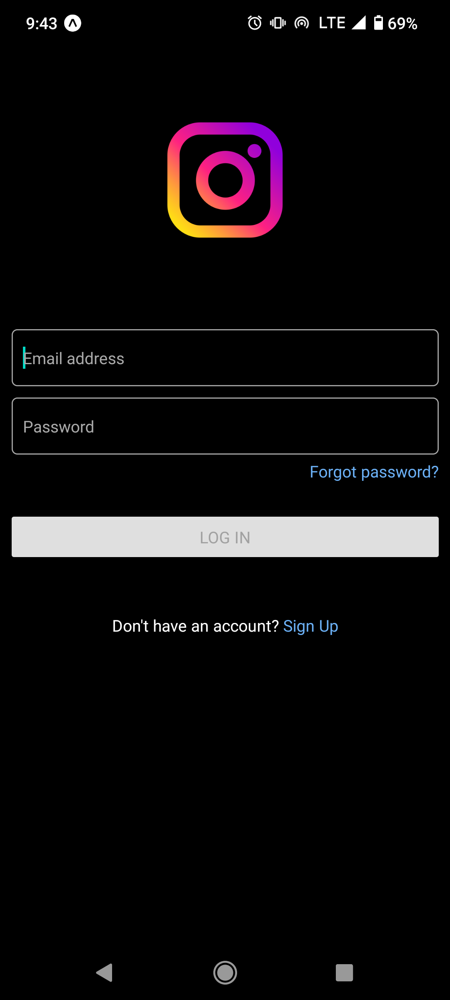
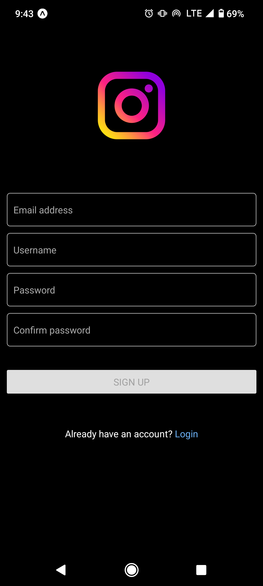
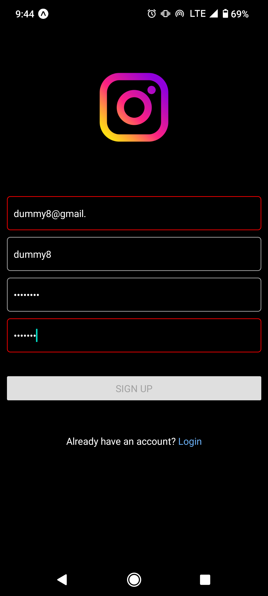
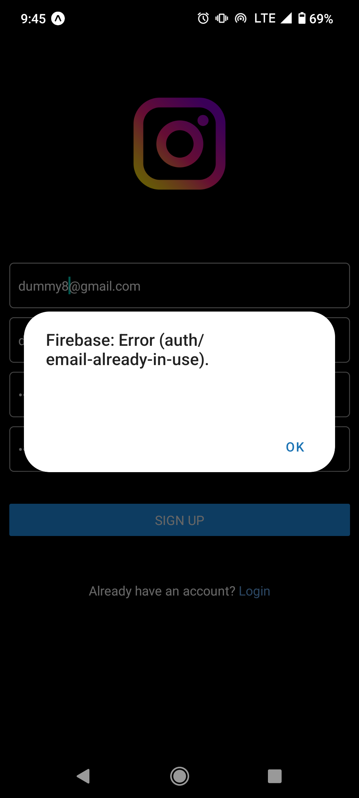
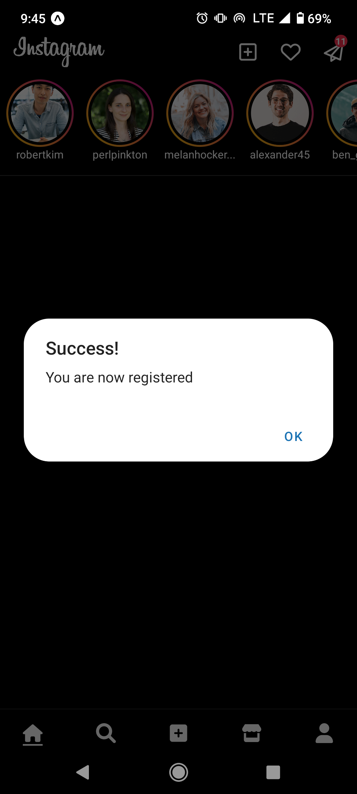
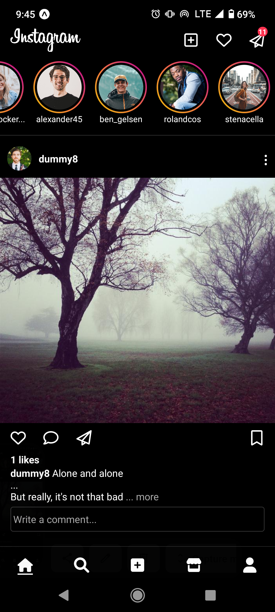
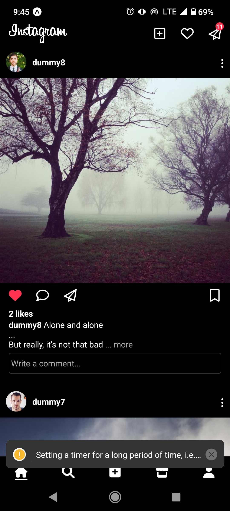
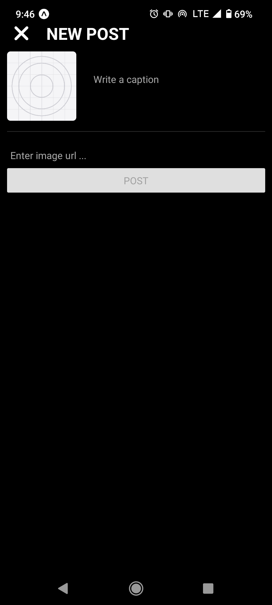
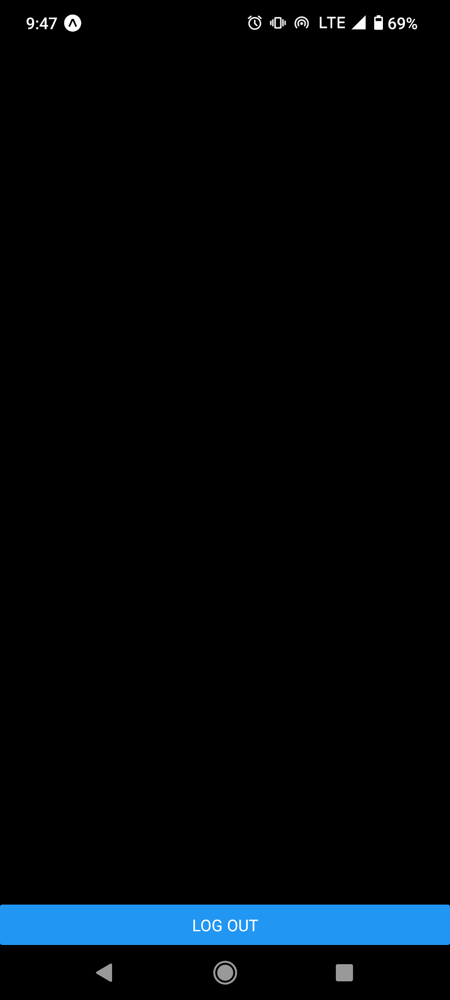

# Instagram Clone using React Native

### This is still a work in progress

What's working:

  1. Home Screen
     - Header
     - Stories
     - Post
     - Like and unlike
     - Comments
     - Bottom Tabs
  2. New Post Screen
     - Thumbnail Preview
     - Caption
  3. Login Screen
     - Sign in with email and password
  4. Logout Screen
  5. Signup Screen
     - Sign up with email and password

Used techs:
  1. React Native
     - Expo
     - React Hook Form
     - React Navigation
     - Expo Linear Gradient
     - React Native Font Awesome
  2. Firebase 9
     - User authentication
     - Database

NOTE: You have to configure your Firebase in firebaseConfig.js before you can run the app

Screenshots:

